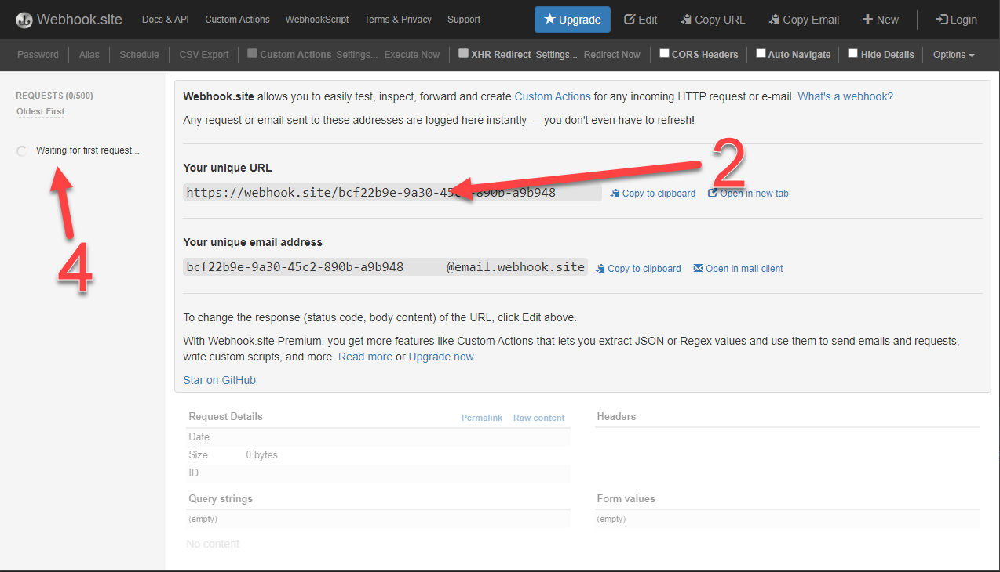

# Use Case 6: Add Notification Channel

This code demonstrates how to add a notification channel to a specific asset.

If you have not configured your credentials in the `settings.yaml` file in the root folder,
the program will ask you to input your username, password, or API key.

To run the code, execute:

    python use_case_6_add_notification_channel.py >ASSET ID LIST< -nt >NOTIFICATION TYPE< -nc >NOTIFICATION CHANNEL< -u >URL<
    
For example:

    python use_case_6_add_notification_channel.py 1234 4567 -nt 13 -nc 3 -u https://webhook.site/bcf22b9e-9a30-45c2-890b-a9b948XXXXXX
    
## Arguments
### Asset ID List
Defines to which assets this notification channel should apply.

### Notification Type
Defines, what kind of notifications should be set up for the defined assets.
- load measurement alert = 2
- load measurement alarm = 3,
- measurement taken reminder = 5        
- asset nameplate data edited = 9        
- low battery capacity = 12        
- load measurement notification = 13        

### Notification Channel
Defines the interface where the notification should be sent
- webhooks = 3

### URL
The URL is the endpoint of the notification, where your own server shall be used . In case you do not have an own server available, the website https://webhook.site can be used for testing purposes at the user’s own risk. 
The accountability for the use of the software https://webhook.site is with the user.
1. Go to [https://webhook.site](https://webhook.site)
2. Copy `Your unique URL`
3. Use this URL as an argument
4. See the notifications in the left column of the website

